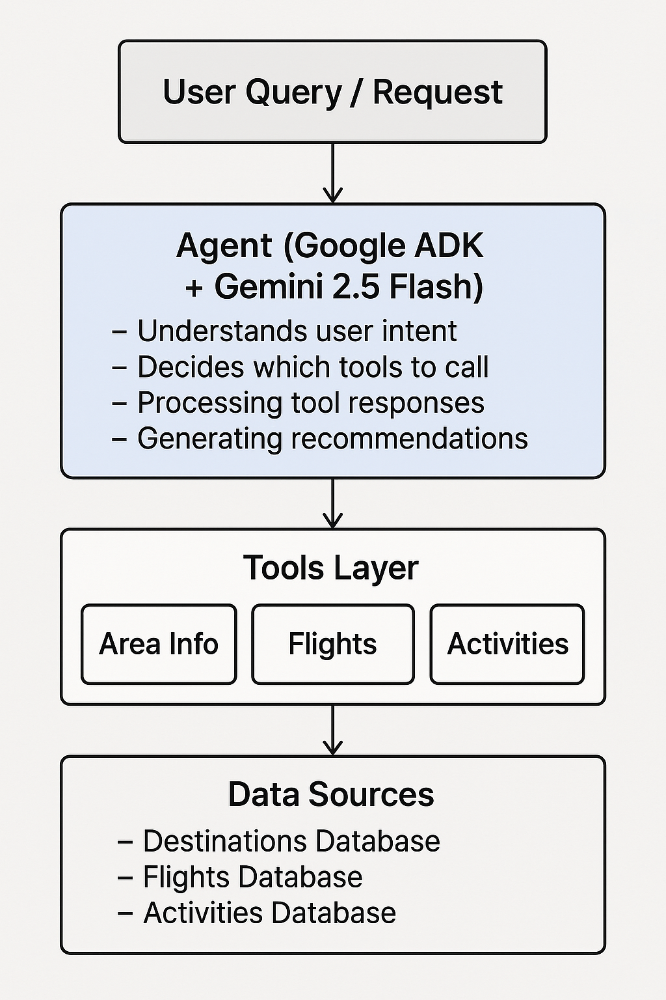

# Lab 101: Agentic AI Trip Planner

## Overview

This lab demonstrates a **Trip Planning Agentic AI** built using Google's Agent Development Kit (ADK). The agent helps users plan their travels by providing intelligent recommendations for destinations, flights, and activities based on their preferences, budget, and travel goals.

## What is Agentic AI?


Agentic AI refers to artificial intelligence systems that can autonomously perform tasks by:
- **Understanding user intent** through natural language
- **Making decisions** about which tools to use
- **Executing actions** by calling appropriate functions
- **Reasoning** about the results to provide helpful recommendations
- **Following workflows** to ensure accurate and complete responses

Unlike traditional chatbots that rely solely on pre-trained knowledge, agentic AI systems actively use tools and databases to retrieve real-time, accurate information before making recommendations.

## Architecture

### System Diagram



### Core Components

```
┌─────────────────────────────────────────┐
│         User Query/Request              │
└─────────────────┬───────────────────────┘
                  │
                  ▼
┌─────────────────────────────────────────┐
│      Agent (Gemini 2.5 Flash)          │
│  - Understands user intent              │
│  - Decides which tools to call          │
│  - Processes tool responses             │
│  - Generates recommendations            │
└─────────────────┬───────────────────────┘
                  │
                  ▼
┌─────────────────────────────────────────┐
│              Tools Layer                │
│  ┌─────────────┐  ┌─────────────┐      │
│  │ Area Info   │  │  Flights    │      │
│  └─────────────┘  └─────────────┘      │
│  ┌─────────────┐                       │
│  │ Activities  │                       │
│  └─────────────┘                       │
└─────────────────┬───────────────────────┘
                  │
                  ▼
┌─────────────────────────────────────────┐
│         Data Sources                    │
│  - Destinations Database                │
│  - Flights Database                     │
│  - Activities Database                  │
└─────────────────────────────────────────┘
```

### Agent Configuration

- **Model**: `gemini-2.5-flash`
- **Name**: `root_agent`
- **Type**: Single agent with multiple tools
- **Instruction Strategy**: Tool-first approach (always uses tools before making recommendations)

## Key Features

### 1. **Tool-First Approach**
The agent is explicitly instructed to **always use tools** before making recommendations. This ensures:
- Data accuracy from authoritative sources
- Up-to-date information
- No reliance on potentially outdated model knowledge

### 2. **Three Specialized Tools**

#### 🌍 `get_area_information`
Retrieves comprehensive destination information including:
- Best travel seasons
- Weather conditions
- Cultural highlights
- Local cuisine
- Budget levels
- Language and currency

**Supported Destinations:**
- Germany
- Switzerland
- Saudi Arabia
- Dubai
- Poland
- China

#### ✈️ `get_flight_options`
Provides flight information from multiple airlines:
- **Luxury**: Qatar Airways, Emirates
- **Economy**: Wizz Air, FlyDubai
- **Mid-range**: Saudi Airlines

Each option includes:
- Price ranges
- Service class
- Features and amenities
- Best use cases
- Destination coverage

#### 🎯 `get_activities`
Suggests activities for specific destinations:
- Cultural tours
- Adventure activities
- Food & drink experiences
- Nature excursions
- Sightseeing options

Each activity includes:
- Duration
- Price range
- Detailed descriptions
- Activity type

### 3. **Intelligent Workflow**

The agent follows a structured workflow:

1. **User Query Analysis**: Understands what the user needs
2. **Tool Selection**: Chooses appropriate tool(s) based on query
3. **Data Retrieval**: Calls tools to get relevant information
4. **Data Analysis**: Processes tool responses
5. **Recommendation Generation**: Provides personalized suggestions

### 4. **Context-Aware Recommendations**

The agent considers:
- User preferences
- Budget constraints
- Travel goals
- Destination characteristics
- Seasonal factors

## How It Works

### Example Interaction Flow

```
User: "I want to plan a trip to Germany with a moderate budget"

Agent Process:
1. Calls get_area_information("germany")
   → Retrieves Germany destination details
   
2. Analyzes: moderate budget, Germany characteristics
   
3. Calls get_flight_options(destination="Germany", budget="moderate")
   → Retrieves flight options matching budget
   
4. Calls get_activities("germany", budget="moderate")
   → Retrieves activities within budget range
   
5. Generates comprehensive recommendation:
   - Best time to visit
   - Flight suggestions
   - Activity recommendations
   - Budget considerations
```

### Agent Instructions

The agent is configured with strict instructions:

```
CRITICAL: You MUST ALWAYS use the provided tools to get information 
BEFORE making any recommendations or answering questions.

RULES:
- NEVER make recommendations without first calling the appropriate tool
- ALWAYS use the data returned from tools as the source of truth
- Only use information that comes from the tool responses
```

This ensures the agent acts as a **tool-using agent** rather than a knowledge-based chatbot.

## Technical Implementation

### Dependencies

- `google-adk`: Google Agent Development Kit
- `python-dotenv`: Environment variable management

### Project Structure

```
lab_101/
├── __init__.py          # Package initialization
├── agent.py             # Agent definition and configuration
├── tools.py             # Tool implementations and databases
└── README.md            # This file
```

### Agent Definition

The agent is defined in `agent.py` with:
- Model specification
- Name and description
- Detailed instructions
- Tool registration

### Tool Implementation

Tools are implemented in `tools.py` with:
- Function definitions with type hints
- Comprehensive docstrings
- In-memory databases (can be replaced with external APIs)
- Error handling and validation

## Use Cases

1. **Destination Discovery**: "What are good destinations for summer travel?"
2. **Flight Planning**: "Find me affordable flights to Dubai"
3. **Activity Planning**: "What can I do in Switzerland?"
4. **Complete Trip Planning**: "Plan a 5-day trip to Saudi Arabia with activities"

## Advantages of Agentic AI Approach

1. **Accuracy**: Uses authoritative data sources instead of model knowledge
2. **Flexibility**: Easy to update databases without retraining
3. **Transparency**: Clear workflow of tool calls and data retrieval
4. **Extensibility**: New tools can be added easily
5. **Reliability**: Consistent responses based on structured data

## Future Enhancements

Potential improvements:
- Integration with real-time flight APIs
- Weather API integration
- Hotel booking tools
- Itinerary generation
- Multi-agent collaboration (specialized agents for different aspects)
- Memory/context persistence across conversations

## Getting Started

### Prerequisites

- Python 3.8+
- Google ADK installed
- API credentials configured

### Installation

```bash
pip install -r requirements.txt
```

### Usage

```python
from lab_101.agent import root_agent

# The agent can be integrated into your application
# and used to handle user queries about trip planning
```

## Key Takeaways

This lab demonstrates:
- ✅ Building agentic AI systems with Google ADK
- ✅ Tool-first architecture for accurate recommendations
- ✅ Structured data retrieval and processing
- ✅ Natural language understanding for travel planning
- ✅ Best practices for agent instructions and workflows

---

**Note**: This is a demonstration lab. In production, you would integrate with real APIs for flights, hotels, and activities rather than using in-memory databases.

